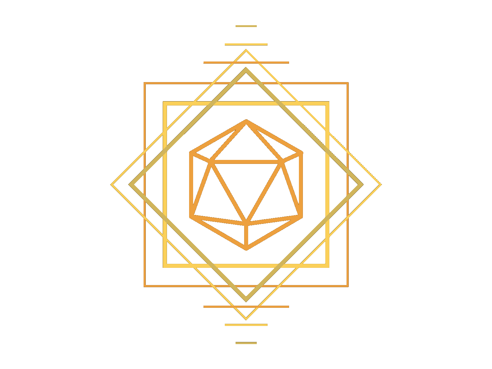

<!-- Project Tab things -->

 

<!-- PROJECT LOGO -->
 

  

  <h3 align="center">Sovereign of Chaos</h3>

  

    A small-scale bot made in Python, capable of handling several D&D related tasks on Discord. Built using Discord.py and hosted on repl.it
  

<!-- TABLE OF CONTENTS -->

  
Table of Contents

  <ol>
    <li>
      <a href="#about-the-project">About The Project</a>
      <ul>
        <li><a href="#built-with">Built With</a></li>
      </ul>
    </li>
    <li><a href="#usage">Usage</a></li>
    <li><a href="#contributing">Contributing</a></li>
    <li><a href="#license">License</a></li>
    <li><a href="#contact">Contact</a></li>
  </ol>

<!-- ABOUT THE PROJECT -->
## About The Project

A small-scale bot made in Python, capable of handling several D&amp;D related tasks on Discord. Built using Discord.py and hosted on repl.it

Features include:
* ***Advice Giving*** - Essentially an 8-ball, you ask the Traveler a question and he will do his best to answer.
* ***Dice Rolling*** -  Using the d20 package for Python, a custom dice roll interpreter is available for users to type in the roll they want, and the Traveler will provide!
* ***Initiative Tracking*** - The Traveler allows DMs to grab initiative for combat without needing to worry about everyone yelling it at the same time. Upon initialization, the Traveler listens for every valid creature input on the channel until the DM determines the order is complete. Can add, edit, remove, and shuffle the initiative order while it is online.
* ***Magic Item Generator*** - Players (or users) can use the Traveler to determine a random magical item. When rolling, rarity can be set for the following settings currently: Uncommon (UC), Rare (R), and Very Rare (VR)
* ***Skill Challenge Tracking*** - An alternative version to handling multiple related rolls at once. The Traveler has a number of presets for easily enabling a skill challenge to be tracked in a discord server. Uses the rules and notes listed on the [Critical Hits Blog](https://critical-hits.com/blog/2016/08/16/skill-challenges-in-5th-edition-dd/)

### Built With

* [Python](https://www.python.org/)
* [Discord.py](https://discordpy.readthedocs.io/en/stable/)
* [Flask](https://flask.palletsprojects.com/en/2.0.x/)
* [d20](https://pypi.org/project/d20/)

<!-- USAGE EXAMPLES -->
## Usage

_For examples and a list of commands, please refer to the [Documentation](https://magicalmusings.github.io/sovereign/)_

<!-- ROADMAP -->
## Roadmap

See the [open issues](https://github.com/andresgsepulveda/Sovereign-of-Chaos/issues) for a list of proposed features (and known issues).

<!-- CONTRIBUTING -->
## Contributing

Contributions are what make the open source community such an amazing place to be learn, inspire, and create. Any contributions you make are **greatly appreciated**.

1. Fork the Project
2. Create your Feature Branch (`git checkout -b feature/AmazingFeature`)
3. Commit your Changes (`git commit -m 'Add some AmazingFeature'`)
4. Push to the Branch (`git push origin feature/AmazingFeature`)
5. Open a Pull Request

<!-- LICENSE -->
## License

Distributed under the MIT License. See `LICENSE` for more information.

<!-- CONTACT -->
## Contact

Andres G Sepulveda Morales - [LinkedIn](https://www.linkedin.com/in/andresgsepulveda/) - andres.sepulveda808@gmail.com
